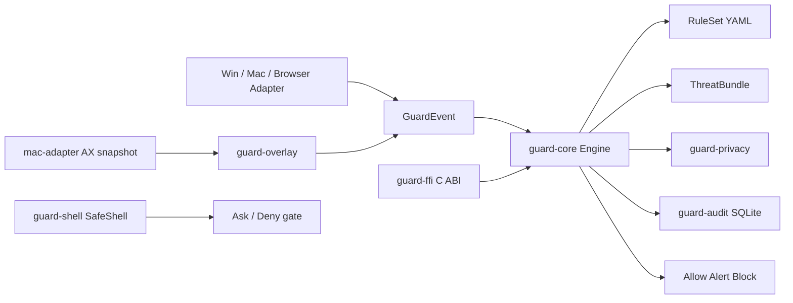

# Architecture

Scope boundaries (what this does **not** do — notably: it is not a sandbox and does
not protect the filesystem): [scope-and-non-goals.md](./scope-and-non-goals.md).

## Event flow

## Crates

| Crate | Role |
|-------|------|
| `guard-schema` | Shared types, rule/policy YAML |
| `guard-privacy` | GuardContract + OP/TR/FM scores |
| `guard-core` | Decision pipeline + intel + confirm gate |
| `guard-audit` | Local SQLite audit + session summary |
| `guard-eval` | Offline scenario runner |
| `guard-intel` | Threat bundle + Ed25519 / legacy sha256 verify |
| `guard-overlay` | Structured UI region → overlay findings → `[AG_*]` markers |
| `guard-ffi` | C ABI (`ag_engine_*`) for Swift / macOS hosts |
| `guard-shell` | Aura-lite safe shell: allowlist / deny / confirm |
| `guard-cli` | Developer CLI |
| `guard-nm-host` | Chrome Native Messaging host |
| `win-adapter` / `mac-adapter` / `browser-adapter` | Observation → GuardEvent |

## Threat intel (Phase 2)

- Bundle: `intel/bundle.json`（domains / deeplinks / injection / overlay markers）
- Sign: `guard-cli intel-keygen` → `intel-sign` → `intel-verify --pubkey …`
- CDN: `intel/cdn-manifest.json` + `guard-cli intel-fetch`（http(s) / file://）
- Engine: `with_intel` / `reload_intel`；匹配命中 `INTEL-DOMAIN` / `INTEL-INJECT`
- Legacy `sha256:` digest still accepted when no pubkey is provided

## Overlay detection (Phase 2)

- `guard-overlay`: structured `UiRegion` observations → `OverlayFinding` heuristics
- Heuristics: `opacity < 0.05`, `font_size_px < 1`, offscreen + injection patterns, `[AG_*]` markers
- `DisplayGeometry` (A2): rounded-corner width `w(y) = R − √(R² − (R−y)²)` +
  `DisplayCutout` rects → `[AG_MASKED_ZONE]` / `OVL-012`. Catches opaque,
  normal-sized text that the opacity / font-size heuristics wave through
- `mac-adapter::viewtree`: accessibility-tree text vs frame OCR text →
  `[AG_VIEWTREE_SCREEN_ONLY]` (`OVL-009`, alert) and `[AG_VIEWTREE_TREE_ONLY]`
  (`OVL-010`, block+confirm) — AgentScan Viewtree Interference
- `mac-adapter::framehash`: 16×9 grid digest (luma + Cb/Cr, 4-bit quantised) →
  localized-edit detection (`[AG_FRAME_REGION_TAMPER]` / `OVL-013`) and a signed
  `frame_digest` in the audit trail; `guard-cli frame-digest` verifies a host frame
  against it. Replaces the mean-luma A4 check, which could not reach the attack —
  [frame-integrity.md](./frame-integrity.md)
- `mac-adapter::stego`: luma LSB rate (`OVL-008`) **and** Cb/Cr rate
  (`[AG_STEGO_CHROMA]` / `OVL-011`), since the published A4 preserves luminance
- `mac-adapter::subliminal`: strong band `[0.008, 0.08)` plus a wide band
  `[0.08, 0.22)` covering the 8–20 % opacity range
- `mac-adapter::ax_tree`: `AxSnapshot` → `flatten_text` → `ingest_ax_snapshot` → `GuardEvent` with overlay metadata
- Findings map to `ui_text` markers consumed by P0 rules and threat intel

## FFI (Phase 4)

- `guard-ffi` exports `ag_engine_new`, `ag_engine_free`, `ag_engine_process_json`, `ag_string_free`
- Built as `cdylib` + `staticlib` for Swift / macOS menu-bar hosts
- JSON in/out: `GuardEvent` → `Decision`

## Safe shell (Aura-lite)

- `guard-shell`: YAML policy with allowlisted tools, denied actions, `require_confirm` set
- `SafeShell::propose(action) -> Allow | Deny | Ask`; `evaluate()` adds rule id + evidence
- Shell-injection screening runs **before** the allowlist (`SHELL-METACHAR`),
  and `SafeShell::argv()` hands back a parameterized vector — (A)I Sees A7
- See [safe-shell.md](./safe-shell.md)

## macOS permissions

`mac-adapter::permissions` probes:

- `AXIsProcessTrusted`（辅助功能）
- `CGPreflightScreenCaptureAccess`（屏幕录制）

`mac-adapter::ax_tree` provides `AxSnapshot::from_sim_json`, `flatten_text`, and `MacAdapter::ingest_ax_snapshot` / `capture_live_ax` (ObjC `AXUIElement` frontmost walk). Desktop wires `process_with_revalidate` on consecutive UiTreeDelta frames.

## Environment survey (Android)

- `EnvironmentScanner` (companion) → `env_survey` envelope → `EventType::EnvironmentSurvey`
- `[AG_BROADCAST_INPUT_SINK]` → `ENV-A5` block+confirm; `[AG_FOREIGN_A11Y_SERVICE]`
  → `ENV-A6` alert; clean survey → `ENV-CLEAN` (clears the latch)
- `Engine::env_risk()` is standing state: a HIGH-tier fill while input is observed
  becomes `ENV-INPUT-OBSERVED` block+confirm
- Limits (runtime receivers, package visibility): [android-env-survey.md](./android-env-survey.md)

## Audit integrity

- `guard-audit::chain` — keyless SHA-256 chain: tamper-evident against an editor
  who does not recompute it
- `guard-audit::signing` — Ed25519 signature per record/receipt over the chain
  hash, with `key_id` and (for receipts) `actor` inside the signed payload;
  `AuditSigner` is the seam for a Secure Enclave / TPM backend
- `guard-cli audit-keygen` / `audit-verify --pubkey … [--require-full-coverage]`
- Threat model and what is *not* achieved: [audit-signing.md](./audit-signing.md)

## Confirm gate

`Engine::process_gated` prompts when `require_confirm` is set.
Deny/Timeout pauses the session (`SESSION-PAUSED`) until `resume()`.

`Engine::revalidate_ui` / `process_with_revalidate` compare UI fingerprints before execute (pop-up / TOCTOU). Mismatch → `UI-REVALIDATE`.

## Form schemas

`policies/forms/*.yaml` + `guard-privacy::classify` map field labels to profile keys / FM / TR.
macOS AX ingest emits `FormFill` for filled editables.

## Privacy scoring

`guard-privacy::scoring` implements MyPhoneBench §2.4–2.5 verbatim: TR is
normalized by the trap population, un-exercised dimensions are `None` (not 1.0)
and excluded from `|D|`, and `qualifies(tau, task_success)` requires the task
outcome. See [myphonebench-mapping.md](./myphonebench-mapping.md).
## Desktop shells

- `apps/desktop-windows` — Dashboard + Critical Confirm（真机 UIA 测试延后）
- `apps/desktop-macos` — Menu Bar tray + TCC + AX snapshot
- `apps/extension-chromium` — MV3 Web Shield（含 Store 打包脚本）
- `apps/android-companion` — Accessibility 伴随守护脚手架

## Additional crates (Phase 2–4)

| Crate | Role |
|-------|------|
| `guard-overlay` | 浮层 / 隐形文字启发式 |
| `guard-ffi` | Swift C ABI |
| `guard-shell` | Aura-lite 安全壳 |
| `guard-sync` | 企业/Pro 策略同步 POC(生产走 `pull_policy_verified`:Ed25519 分离签名验证 + 拒明文 http + 限大小;`pull_policy` 未认证,仅本地/开发) |
| `guard-netmon` | 外传元数据启发式 |
| `android-adapter` | Accessibility JSON → GuardEvent |
