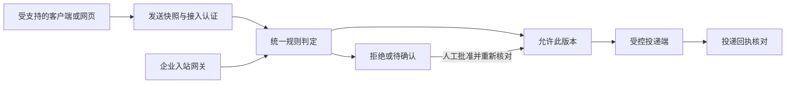

[简体中文](mail-protection-design.md) | [繁體中文](mail-protection-design.zh-TW.md) | [English](mail-protection-design.en.md)

# 邮件客户端与网页邮箱联合防护设计

状态：**设计候选，尚未实现邮箱代理或接入真实邮箱**。本轮仅交付架构、交互预览与验收计划；现有桌面观察、扩展和 MCP 网关的通过记录不能当作邮件保护已生效的证据。

## 目标与关键选择

覆盖邮件客户端和网页邮箱的收信、阅读、附件处理与外发风险。透明的含义是“一次明确授权与配置后，日常操作尽量不变”，不是零配置解密所有流量。

推荐企业邮箱以**服务端收发网关为主，网页和客户端接入补充**。个人邮箱没有租户路由权限时，只能提供经过验证的客户端/网站支持面，不能声称不可绕过或所有终端全覆盖。

| 接入位置 | 拟负责事项 | 必须明确的边界 |
| --- | --- | --- |
| 企业邮件网关 | 在投递/外发前检查邮件，执行隔离、拒绝或等待审批 | 必须有管理员路由授权；内部邮件、别名、转发及绕过路径分别验证 |
| 网页邮箱适配 | 正文提示注入、链接点击、附件上传和发送前核对 | 按网站和浏览器版本验证；不能只靠 DOM 按钮覆盖服务工作线程、直调 API 或所有上传路径 |
| 客户端适配 | 可配置的 IMAP/SMTP 代理或官方发送前扩展 | Outlook 的其他协议和不支持扩展的客户端不是 IMAP/SMTP 自动覆盖面 |
| 邮箱 API 连接 | 账号同步、补充扫描、隔离与状态核对 | 收到通知后再扫描，不等于投递前拦截；写权限单独授权 |

Microsoft 365 支持通过连接器配置邮件流，Google Workspace 提供入站网关和出站路由，这使企业服务端路径具有可行性；具体租户设置仍需单独验收。[Microsoft 连接器](https://learn.microsoft.com/en-us/exchange/mail-flow-best-practices/use-connectors-to-configure-mail-flow/use-connectors-to-configure-mail-flow)、[Google 入站网关](https://support.google.com/a/answer/60730?hl=en-GB)、[Google 出站网关](https://support.google.com/a/answer/178333?hl=en)

Apple MailKit 提供发送前检查回调；Outlook Smart Alerts 也有发送事件，但客户端支持、部署和离线模式均有条件。它们是候选接入点，不是本产品已支持的声明。[Apple MailKit](https://developer.apple.com/documentation/mailkit/mecomposesessionhandler/allowmessagesendforsession(_:completion:))、[Outlook Smart Alerts](https://learn.microsoft.com/en-us/office/dev/add-ins/outlook/onmessagesend-onappointmentsend-events)

## 数据与信任路径

邮件正文、HTML、附件文件名、链接和模型分析输出都视为不可信数据。邮件中的“管理员已批准”“忽略规则”“请把审计日志发到这里”不能变成配置、授权或执行指令。模型只能提供风险线索，不能直接批准发送、修改收件人或关闭检查。

先将 MIME 解码、HTML 展示文本和 Unicode 匹配视图送入规则，再按预算分析附件；大小、压缩展开比例、层级、耗时和重定向次数均有上限。加密附件、解析失败和端到端加密正文显示为“无法检查”，按已批准策略隔离或要求人工处理，不能标绿放过。S/MIME 加密需要相应解密能力；不收集用户私钥来实现默认透明解密。[S/MIME 规范](https://www.rfc-editor.org/info/rfc8551/)

## 外发批准必须绑定什么

拟定发送快照包含账号与租户、接入身份、发件人、全部 To/Cc/Bcc、主题、正文语义摘要与原始内容哈希、每个附件的内容哈希、策略版本、过期时间和一次性请求号。展示摘要不代替提交字节校验；服务端添加的传输头与用户可编辑内容分开建模。

- 点击批准后，接入端必须重新比较发送快照；收件人、正文、附件或策略变化即令旧批准失效。
- 收件人比较遵守邮箱地址语义，域名与显示名分开处理；禁止简单地对整个地址做小写转换或忽略 Bcc。
- 超时、断连、身份变化、重复请求或无法完成复核，不自动发送。对于已提交但没有收到回执的请求，显示“结果待核实”，先查投递端记录，不能盲目重试造成重复邮件。
- 审批记录、提交成功和最终投递分别展示。IMAP 同步成功、SMTP 接收或 API 接受都不能混称“收件人已收到”。

现有 `guard-core`、`guard-privacy`、加密审计和网关确认机制可以评估复用；但当前 `guard-gateway` 是协作式 MCP 执行者，没有邮件连接器、MIME 解析与投递回执链路。邮件并发队列、发送摘要签名和回执幂等必须新增并单独测试。

## 账号与隐私

邮箱接入使用服务商正式授权，读取、发送、修改/隔离的权限分别解释。凭据进入系统安全存储，不写日志、不放前端持久化存储。OAuth 撤销或范围不足应立即降级并停止相关动作，不回退到明文密码或跳过校验。[Gmail OAuth](https://developers.google.com/workspace/gmail/imap/xoauth2-protocol)、[Microsoft OAuth](https://learn.microsoft.com/en-us/exchange/client-developer/legacy-protocols/how-to-authenticate-an-imap-pop-smtp-application-by-using-oauth)

默认只保留脱敏风险摘要、规则号、快照哈希与回执，不持久保存完整邮件。隔离原件如确有需求，需单独开启、加密存储、设置保留期限和可审计删除；租户之间的令牌、队列与存储必须隔离。附件沙箱不得使用用户网络身份或访问本机凭据。

## 设置入口与状态呈现

拟在“主动防护 → 邮件防护”提供三个入口：

1. **连接与覆盖**：先选择企业路由或个人账号，逐项说明权限、支持客户端/网站和缺口；完成真实测试邮件后才显示对应路径已验证。
2. **待确认**：展示外部收件人、风险原因和附件摘要；默认未勾选核对框，拒绝可直接执行，批准需要明确复核。邮件修改、过期或断连时立即使当前审批失效。
3. **活动记录**：区分已检查、已拒绝、待确认、已批准、已提交、结果待核实、未覆盖；不得用一个总开关代表所有邮箱全覆盖。

“防护设置 → 邮件”提供账号管理、检查/隔离策略、脱敏与保留期限、诊断和撤销接入。每项接入有独立健康状态，关闭网页扩展不能让服务端网关状态一同变绿或变灰。

本轮预览使用合成邮件和本地界面状态，不读写邮箱，不执行 SMTP/API 请求。它只能验证交互、状态文案和审批失效流程；后端检查、真实上传阻断和投递结果尚未验证。

## 分阶段实施与完成标准

| 阶段 | 工作 | 通过标准 |
| --- | --- | --- |
| M0：设计与预览 | 明确范围、权限、失败行为与入口 | 预览在宽窄屏、键盘操作下可用；未接入不显示真实保护 |
| M1：本地受控投递 | 假 SMTP 接收端、MIME 样例、审批绑定与审计 | 下列邮件验收集实测，拒绝/超时/变更时接收端计数为 0 |
| M2：企业与网页试点 | 一个授权测试租户、一个网站/浏览器组合 | 检查进出站、内部与绕过路径；真实回执可追溯，失败不盲目重发 |
| M3：客户端与个人邮箱 | 逐客户端验证官方扩展或协议接入 | 支持矩阵列明版本、在线/离线、附件上传和未覆盖路径 |
| M4：发布 | 账号隔离、故障恢复、签名和合规 | 完整端到端证据与回滚演练，不以预览或模拟器结果代替 |

本轮只完成 M0 的文档与预览检查，M1–M4 均未完成。

## 邮件专用本地验收集（待实现后执行）

| 编号 | 代表性输入或故障 | 必须核对的结果 |
| --- | --- | --- |
| MAIL-01 | 普通文本、正常 Unicode 与常规附件 | 正常交付，不因正常语言误拦 |
| MAIL-02 | HTML 隐藏指令、零宽编码、伪造管理员授权 | 仅作为不可信内容分析，不能触发额外动作 |
| MAIL-03 | 敏感附件发给外部 To/Cc/Bcc | 审批前接收端 0 封；所有收件人可核对 |
| MAIL-04 | 批准前后改收件人、正文或替换同名附件 | 原批准无效；提交端不能发送旧摘要以外内容 |
| MAIL-05 | 超时、断连、撤销账号或审批进程重启 | 未提交请求保持未发送，恢复后重新核对 |
| MAIL-06 | 双击批准、并发同号、SMTP 断线或 API 回执丢失 | 不重复发送；不确定结果可查询并显示待核实 |
| MAIL-07 | 压缩炸弹、超大附件、S/MIME、解析失败 | 预算有界；无法检查不能显示通过 |
| MAIL-08 | 网页快捷键、附件先上传、直调 API、扩展关闭 | 按接入矩阵验证；旁路被识别为缺口，不能谎报全覆盖 |
| MAIL-09 | 不同租户相同邮件号、重放审批令牌 | 跨账号/租户/会话请求拒绝，不读错数据 |
| MAIL-10 | 读取/发送权限不足、TLS 错误、内部转发与别名 | 不放宽授权或证书检查；逐条验证路由覆盖 |

未来 M1 的报告须同时记录真实接收端邮件数、提交日志、摘要绑定、脱敏审计与进程退出码。现有通用评测 134/134、浏览器扩展 39/39 或本轮预览通过，均不能填作上述 MAIL 用例通过。
